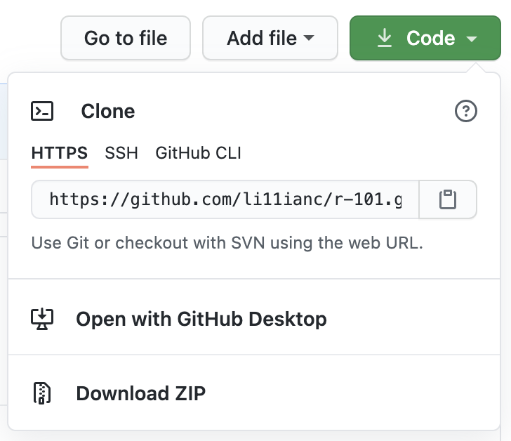
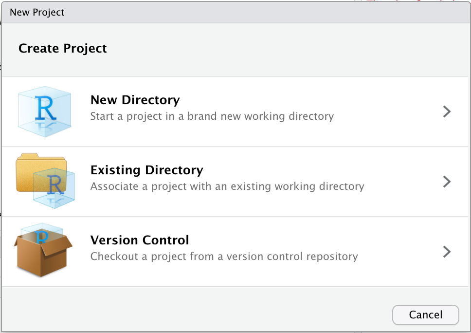
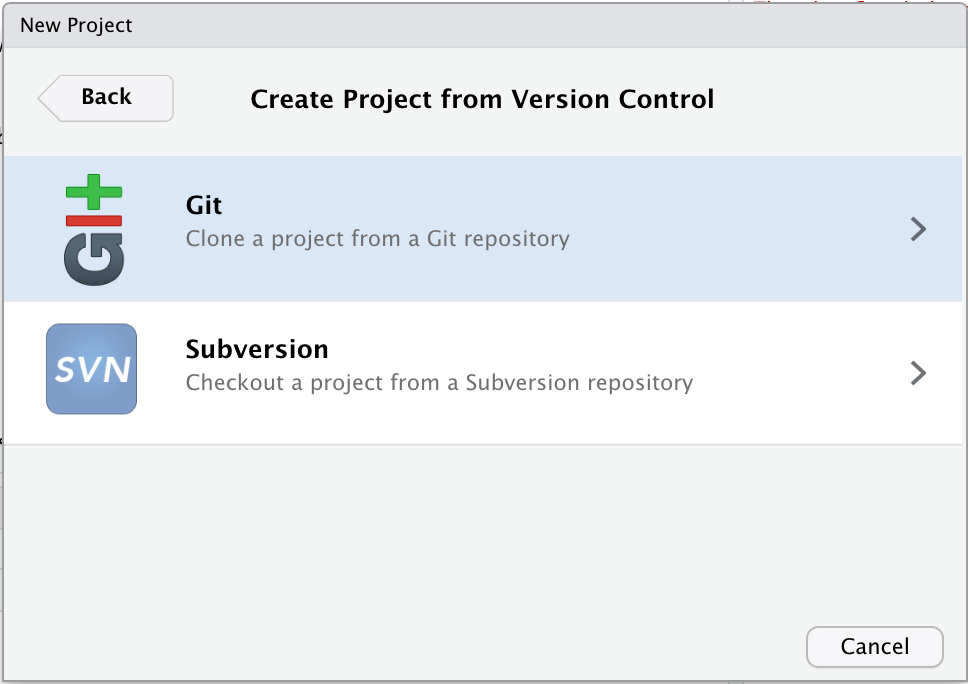
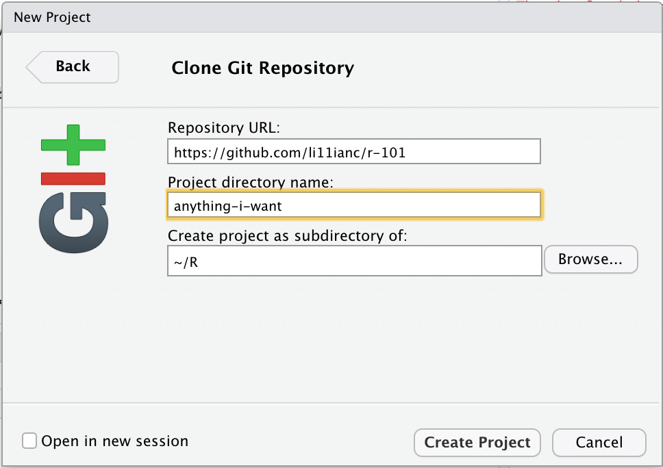

```{r setup, include=FALSE}
#install.packages("prettydoc")
library(prettydoc)
library(tidyverse)
```

### Introduction

In this workshop, you will learn to use R and RStudio with GitHub and build a foundation for future data analysis and vizualization projects (including Shiny Apps!). RStudio is the Interactive Development Environment we use to work in R.

## Set up RStudio and GitHub

### Download RStudio

RStudio is available for free download, but you can also use [RStudio in the Cloud](https://rstudio.cloud/) for free (if you have no more than 15 projects/spend less than 15 project hours per month/etc.). OIT also has [docker containers](https://vm-manage.oit.duke.edu/containers) available for you to use RStudio in the cloud. To use these servers, you must be connected to Duke Blue or Duke's VPN.

### Create a GitHub account

If you don't have a GitHub account, go ahead and make one now (it's free). Advice on choosing a user name is [here](https://happygitwithr.com/github-acct.html) (tl;dr keep it professional and short). You'll use GitHub to access the files for this workshop.

### Download Git

You can install Git [here.](http://git-scm.com/downloads) Not sure whether you already have it installed? Type `which git` in your Terminal -- if you have Git installed, this should return the path to your Git executable. If not, you might get something like `git: command not found`.

Once you have Git installed, follow these steps to set up version control:

Click Tools >> Global Options >> Git/SVN (on the side panel) and check the box that says "Enable version control interface for RStudio projects." Enter the path for Git if the "Git executable" field is blank -- to find the path you can type `which git` in your Terminal tab in R and copy the output.

(Also, if I ever mention an RStudio window that you can't find -- i.e. your Terminal, Console, Environment, Git, or Files windoes -- you can try clicking **View** in the toolbar to change those options.)

Having problems? Let me know! You can also try the steps [here](https://happygitwithr.com/install-git.html) or [here](https://support.rstudio.com/hc/en-us/articles/200532077-Version-Control-with-Git-and-SVN).

### Clone the workshop repository

Follow [this link](https://github.com/li11ianc/r-101) to the workshop repo. Click on the **Fork** button in the upper right to create your own copy (so you can commit and push changes without altering the repository for others). Then click on the green "Code" button to clone/download, make sure it says "Clone with HTTPS" and click the clipboard icon to copy the repo URL.



Open RStudio Cloud and click File >> New Project >> Version Control >> Git, then paste the repo URL you copied, rename the project file if you like, decide where to save it and click "Create Project".






If you are using RStudio in the Cloud, this will look slightly different -- click the drop down button next to the "New Project" button and select "New Project from Git Repo". Paste in the URL you copied, check the "Add packages from the base project" box, and click OK.

You should now see the contents of this workshop repo in the **Files** pane in RStudio, cloud or not. You can open `intro-to-r.Rmd` by clicking on it under Files to follow along and copy/run useful code along the way.

### Configure git

Now, we'll use the `use_git_config()` function from the usethis package to get RStudio communicating with GitHub.
Type the following code in your RStudio console, filling in your own first and last name and email associated with your GitHub account.

library(usethis)
use_git_config(user.name="Lillian Clark", user.email="lillian.clark@duke.edu")

If you get the error `Error in library(usethis) : there is no package called ‘usethis’`, run this next code to install the usethis package. You'll always need to install new packages before you use them the first time.

install.packages("usethis")
library(usethis)

If you have your GitHub account and RStudio installed and configured, please drop your favorite fruit in the chat :)

## Getting started 

### Exploring your RStudio window

You can run code in the **console**, but work here is not saved (often helpful for test-driving mini snippets of code, will display the output of all code as you run it). Any objects (dataframes, variables, lists, etc.) you create or load during a session will appear in your **environment**. You can commit, pull or push your work to GitHub using the **git** tab if you are working on an R project connected to a Git repository.

### The first commit

Click on `practice-exercises.Rmd` in the Files window to open it. Change the author to your name and the date to today's date. Then hit "Knit" to turn your R Markdown file into an HTML or PDF file -- practice-exercises.html should open automatically once it's done knitting. Right now it's set to knit as an HTML file, but you can try changing the output field in the .Rmd header to `pdf_document` to see what it will look like as a PDF. The Rmd and HTML are separate files, but you should knit regularly after making changes to your Rmd to update your HTML/PDF output.

Now, go to your Git tab and check the boxes under "Staged" -- both practice-exercises.Rmd and practice-exercises.html should be listed. Hit "Commit", type an informative commit message like "changed name and date" and click "Commit" in the bottom right of the dialog box. Commits are a great way to save your work and keep a record of your changes in case you want to return to an earlier version of your work. 

Next, click the "Push" button in your Git panel in RStudio. RStudio may ask you to enter your GitHub username and password. Your changes should now be reflected in the repo you cloned your project from on GitHub. When working on a collaborative project, you will also pull others' changes using the "Pull" button in the Git panel, but since you are the only one editing your forked repository, there won't be any changes to pull today.

### Anatomy of a code chunk


```{r chunk-label}
# This is a comment and won't actually run -- it helps make your code readable and organized
#### You can also comment out code that you don't want to run (anything on a line that DOESN'T begin with # will run)
date <- "03/03/2021"
print("This is a code chunk!")
```

You can also insert mini pieces of code into a sentence like this: today's date is `r date`. Code in an R Markdown must be within a code chunk to run, but you won't use code chunks if you're working in an R Script (.R) file. 

Depending on how you want your code chunks and their output to display in your knitted HTML/PDF file, you can include any of the following code chunk options in the `{}` of your chunk header.

- `include = FALSE` prevents code and results from appearing in the finished file. R Markdown still runs the code in the chunk, and the results can be used by other chunks.
- `echo = FALSE` prevents code, but not the results from appearing in the finished file. This is a useful way to embed figures.
- `message = FALSE` prevents messages that are generated by code from appearing in the finished file.
- `warning = FALSE` prevents warnings that are generated by code from appearing in the finished.
- `fig.cap = "..."` adds a caption to graphical results.

## R Packages

Today we'll use the following R packages.  

- `tidyverse`: group of packages for data manipulation, exploration and visualization
- `dplyr`: for data wrangling
- `ggplot2`: for data visualization
- `usethis` (we've already used this!)

Uncomment and run the following code to install them all if you like!

```{r install-packages, message = FALSE, warning = FALSE}
#install.packages("tidyverse")
#install.packages("dplyr")
#install.packages("ggplot2")
```

Use `library()` to load the packages in your working environment once you've installed them. Remember -- you only need to install once, but you need to load them every time you launch RStudio.

```{r load-packages, eval = TRUE, echo = TRUE, message = FALSE, warning = FALSE}
#library(tidyverse)
#library(dplyr)
#library(ggplot2)
```

To run code, you have a few options. You can click the green arrow at the top right of the code chunk, highlight the lines you wish to run and hit "Run" at the top right of the pane, hit CTRL+ENTER to run the current line or CTRL+SHIFT+ENTER to run the current chunk.

## Explore the data

### Load data

Today we'll be using a dataset about mammalian sleep that comes built in to ggplot2. 

```{r}
msleep
```

You usually won't be working with data that's already built into R, so for practice we're going to read in the same `msleep` data as a CSV file. 

```{r message=FALSE}
mammal <- read_csv("data/mammal-sleep.csv")
```

(This is the first time you're seeing the assignment operator `<-`. We'll use this a lot!)

I created mammal-sleep.csv using the `write_csv()` function, as in `write_csv(msleep, "data/mammal-sleep.csv")`. You can use write_csv to save data you've modified/filtered/created.

Other functions and packages exist for reading other types of data files (for example, the `readxl` package for loading Excel files or `read_table()` and `read_delim()`).

If you are unsure about what a function does or how to use it, type `?function-name-here` in the Console to populate the Help tab. Try `?read_csv`. Examples at the end of the help reference are often the most useful part for me.

RStudio comes with a variety of built-in functions, and you can use the Help tab to figure out what they do. Try typing the following functions in the Console:

- `?abs`
- `?mean`
- `?sd`
- `?round`

Let's try using `sd()` to compute the standard deviation of this list of values: 3, 7, 9, 82.

```{r}
#sd(3, 7, 9, 82)
```

This gives us an error -- let's refer back to the help page for `sd()` and try again.

```{r}
sd(c(3, 7, 9, 82))
```

Use `c(item1, item2, item3...)` to create lists.

You can also use the Console to find information about packages or datasets they contain, like the `msleep` data we are working with now. Type `?msleep` in the Console. 

If your dataset doesn't come from an R package, you'll have to look elsewhere for a data dictionary.

Note: some useful math expressions

- addition: `+`
- subtraction: `-`
- division: `/`
- multiplication: `*`
- modulus: `%%`
- integer division: `%/%`
- raise to power: `^`

### Data structure and dimensions

`glimpse()` is a great function for observing the general structure of your dataset, especially if it contains many variables (columns) or observations (rows). It will also tell you your variable types -- whether they are characters, integers, doubles, dates, etc.

### Exercise 1

**What are the dimensions of `mammal()`? How many rows and columns does it have?**

```{r}
glimpse(mammal)
```

You can also use `dim()` or look at your Environment pane to answer this question. Sometimes it helps to browse your data to get a feel for it when starting a project, try clicking the table icon in the `mammal` row in the Environment pane or type `View(mammal)` in your Console.

Type `head(mammal)` in the Console window. What does this do? How about `tail(mammal)`?

*Tip:* Use the arrow keys to scroll up or down through your previous commands in the Console and save a bit of typing.

### Exercise 2

Let's do some exploratory data analysis and look at summary statistics!

You've learned the assignment operator, so it's time to introduce the piping operator `%>%`. This is used to pass the output of one line to the next, like in the example below.

```{r}
mammal
```

```{r}
mammal %>%
  filter(order == "Primates") %>%
  select(name, sleep_total) %>%
  arrange(desc(sleep_total)) %>%
  head(5)

mammal %>%
  filter(order == "Rodentia") %>%
  select(name, sleep_total) %>%
  arrange(desc(sleep_total)) %>%
  head(5)
```

**Try this on your own -- see if you can find the mammal of order Rodentia that spends the least time awake.**

R can make logical comparisons like the one in `filter()` above. Use `!=` to mean 'does not equal'. You can also use operators like `>` or `<=` to mean 'is greater than' and 'is less than or equal to'. Also `is.na()` and `!is.na()`. Remember to use `==` for equality, not `=`. Use `|` as "or" and `&` as "and" for multiple conditions. (Also `%in%`!)

### Exercise 3

If you want to look at the contents of one column (or vector) in the data, you can subset a dataframe like so:

```{r}
mammal$sleep_total
```

**Try finding the average total amount of sleep of mammals in the data on your own.**

The `summary()` function can provide good information.

```{r}
summary(mammal)
```

Does it make sense to use the summary function on the variable `order` in our data?

Reminder: Now you've made a few more edits to your R Markdown files, try committing your changes!

### Exercise 4

The `mutate` function allows you to create new variables. Let's create a variable with body weight in pounds instead of kilograms.

```{r}
mammal <- mammal %>%
  mutate(bodywt_lbs = round(bodywt * 2.205, 2))
```

Now let's use `case_when()` within `mutate()` to create a variable that shows whether an animal spends more time asleep than awake.

```{r}
mammal <- mammal %>%
  mutate(sleepy = case_when(
    sleep_total > awake ~ TRUE,
    sleep_total <= awake ~ FALSE
  ))
```

**On your own, create a variable containing the number of sleep cycles the animals experience each night (hint: divide the total amount of sleep by the length of the sleep cycle). Round to one decimal place and call the new variable `num_cycles`**

```{r}
mammal <- mammal %>%
  mutate(num_cycles = round(sleep_total / sleep_cycle, 1))
```

A syntax tip for case_when: use `TRUE ~ orig_variable_name` as a kind of "else" or "in all other cases". So we could also use the following code to create `sleepy`.

```{r}
mammal <- mammal %>%
  mutate(sleepy = case_when(
    sleep_total > awake ~ TRUE,
    TRUE ~ FALSE
  ))
```

Example code, if there were character strings "NA" you needed to change to missing in the data:
mammal <- mammal %>%
  mutate(total_sleep = case_when(
    total_sleep == "NA" ~ as.numeric(NA),
    TRUE ~ total_sleep
  ))


Every value of a variable must be of the same type (i.e. character, numeric, integer, etc.) -- be careful to only create values of the same type when using `case_when()` otherwise your mutate won't work (especially with NA values). `as.numeric()`, `as.character()`, `as.integer()` are useful functions to coerce NA values (and others) to your desired variable type.

### Exercise 5

`group_by()` can be very helpful if you want to answer questions about specific groups or categories of observations in the data. 

For example, we can use `group_by()` to determine how many animals spend more time asleep than awake.

```{r}
mammal %>%
  group_by(sleepy) %>%
  count()
```

We can also use `summarize()` to calculate proportions, means, or other descriptions of our grouped data.

```{r message=FALSE}
mammal %>%
  group_by(sleepy) %>%
  summarize(prop = n()/nrow(mammal))
```

**Use group_by() to determine the proportion of mammals in the data that are carnivores.**

### Exercise 6

`ggplot2` is not the only package for making plots in R, but it's a really good place to start. 

You can find a great ggplot2 cheatsheet [here.](https://rstudio.com/wp-content/uploads/2016/11/ggplot2-cheatsheet-2.1.pdf)

Let's create a plot to look at how total sleep and REM sleep are related.

```{r message=FALSE, warning = FALSE}
ggplot(data = mammal, mapping = aes(x = sleep_total, y = sleep_rem, color = vore)) +
  geom_point() +
  theme_light()+
  labs(title = "REM Sleep vs. Total Sleep in Mammals",
       subtitle = "from msleep, a dataset of the ggplot2 package",
       x = "Total Sleep (hrs)",
       y = "REM Sleep (hrs)", 
       color = "More Time Asleep than Awake")
```

You may need to filter out NAs before plotting -- R does it automatically here.

- data is always the first argument (can go over piping operator exception) 
- within `aes()` (short for aesthetics), assign variables to the x/y axes and other elements of the plot 
- use another layer to specify the kind of plot -- `geom_point()`, `geom_histogram()`, and `geom_boxplot()` are a few common examples
- add a theme to manipulate the appearance of your plot -- `theme_light()` and `theme_classic()` are two of many options
- use `labs()` to add labels
- tip: use `alpha()` for transparency on crowded scatterplots

Notes on `theme()`:
You can build highly cutomized plots by formatting the non-data elements with arguments within `theme()`. See [this link](https://ggplot2.tidyverse.org/reference/theme.html) for a list of optional arguments. This is great for adding horizontal/vertical lines and other annotations to tell the story of your data.

Now let's create a boxplot -- these are helpful for visualizing categorical variables.

```{r}
ggplot(data = mammal, aes(x = vore, y = sleep_rem)) +
  geom_boxplot() +
  labs(title = "REM Sleep Across Mammalian Diets", 
       y = "REM Sleep (hrs)",
       x = "-vore Classification")
```

Note that we didn't add a theme here -- this is the default appearance for plots using ggplot2.

**Now play with ggplot2 and the other skills you've learned to create a plot that interests you.**

## Prep for Shiny Apps

You can use HTML in R for prettier formatting! CSS will also take your Shiny Apps to another level.

### Defining basic functions

In R, we define functions with this format:

name_of_function <- function(input1=DEFAULT_VALUE, input2) {
    what the function does will go in here!!
}

Let's define a function to say hello.

```{r}
say_hello <- function(lastname, firstname="Bob") {
  print(paste0("Hello ", firstname, " ", lastname, "!"))
}
```

`paste()` and `paste0()` can be used to concatenate strings and expressions: the former inserts a space between arguments and the latter does not.

Let's try writing a function to convert hours to minutes (this is something we could use on the time variables in our mammal data if we wanted).

```{r}
function_name <- function(x) {
  return()
}

convert_hours_to_minutes <- function(time) {
  return(time*60)
}
```

When you find yourself writing the same code over and over again, it's a good time to think about writing a function.

### Conditionals: if, else if, and else
 
Nested conditionals example structure:

if (condition_one) {
  
  ## code
  
} else if (condition_two) {
  
  ## code
  
} else {
  
  ## code
  
}

```{r}
x <- -1

if (x > 0) {
  print("x is positive")
} else if (x < 0) {
  print("x is negative")
} else {
  print("x is zero")
}
```

## Troubleshooting

If the code in your Rmd won't knit or won't run in your console, take a look at the warning message R spits out. Usually I think these are pretty cryptic and useless, but try copying and searching the error message you get online. Odds are somebody's already posted about it on Stack Exchange.

Learn by doing! Slogging through warning message after warning message will make you better at this.

## To learn more

Topics I'm happy to introduce if we have extra time and folks are interested: `stringr`, `lubridate`, more with `ggplot2`

 - [Data wrangling cheatsheet](http://www.rstudio.com/wp-content/uploads/2015/02/data-wrangling-cheatsheet.pdf)
 - [R Markdown](https://github.com/rstudio/cheatsheets/raw/master/rmarkdown-2.0.pdf)

## References

https://rmarkdown.rstudio.com/lesson-3.html
Maria Tackett's STA 199 & 210, Shawn Santo's STA 323
